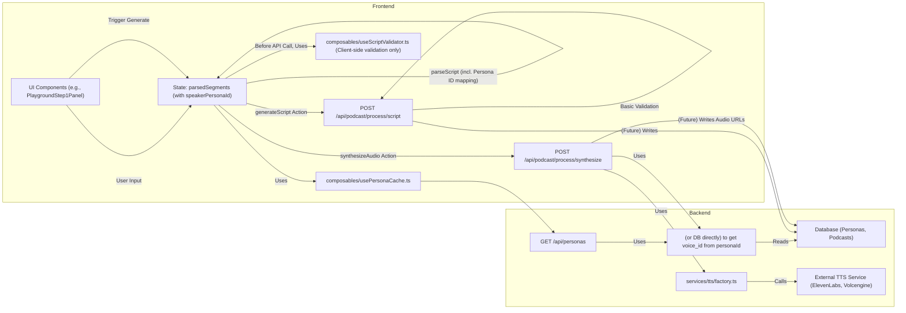

# Playground UI 重构整合最终计划

## 1. 核心原则

*   **统一数据模型**：严格遵循在 `types/api/podcast.d.ts` 中定义的接口，如 `PodcastCreateRequest`、`ScriptSegment`（包含 `speakerPersonaId`）、`PodcastCreateResponse`。
*   **前端主导数据准备**：由 `stores/playgroundUnified.ts` 负责将用户输入转换为后端API所需的标准格式。
*   **后端API简化与透传**：后端API主要负责验证、核心业务逻辑处理（如TTS调用）、数据持久化，避免复杂的数据转换和映射。
*   **Persona ID核心**：所有与角色相关的操作均通过 `Persona ID` 进行。
*   **单向数据流**：保持清晰的数据流向，前端提供最终数据，后端进行验证并在不符合要求时报错。

## 2. 详细计划步骤

### 阶段一：清理和统一前端逻辑

1.  **强化 `stores/playgroundUnified.ts` 的 `parseScript` Action**:
    *   **目标**：使其成为前端唯一的、标准的脚本解析逻辑。
    *   **实现**：
        *   接收原始脚本字符串。
        *   利用正则表达式或更健壮的解析方法，将脚本分割为初步的 `{ speakerName: string, text: string }` 段落。
        *   调用 `usePersonaCache.fetchPersonas()` 确保角色数据已加载。
        *   遍历初步段落，根据 `speakerName` 从 `usePersonaCache.getPersonaByName()` 查找对应的 Persona，获取其 `persona_id`。
        *   生成最终的 `ScriptSegment[]` 数组，其中每个元素包含 `speaker` (原始识别的说话人名称), `speakerPersonaId` (关键ID), 和 `text`。
        *   实现明确的回退逻辑（例如：标记错误提示用户选择，或暂时分配一个默认/主持人的 `speakerPersonaId` 并给出警告）。
        *   处理没有明确说话人标记的行。
    *   **移除冗余**：移除 `composables/useScriptValidator.ts` 中的 `parseScriptToSegments` 函数。

2.  **重构 `composables/useScriptValidator.ts`**:
    *   **目标**：将其定位为一个纯粹的客户端表单级验证器。
    *   **移除**：对 `/api/podcast/process/validate.post.ts` 的API调用和内部的 `parseScriptToSegments` 函数。
    *   **保留/调整**：客户端的输入验证逻辑（如检查播客标题是否为空、是否已选择主持人等），在调用 `playgroundUnified.ts` 的 `generateScript` action 之前执行。

### 阶段二：调整后端API和服务

3.  **废弃 `/api/podcast/process/validate.post.ts`**:
    *   **理由**：其LLM驱动的脚本结构化和 `voiceMap` 生成与重构目标不符。
    *   **操作**：
        *   删除 `server/api/podcast/process/validate.post.ts` 文件。
        *   删除其依赖的 `server/utils/podcastValidationHelpers.ts` 文件（如果此文件没有被其他保留的逻辑所使用）。

4.  **确认 `/api/podcast/process/script.post.ts` 的职责**:
    *   **输入**：严格遵循 `PodcastCreateRequest` 接口。
    *   **处理**：执行必要的安全和格式验证。未来与数据库交互。
    *   **输出**：严格遵循 `PodcastCreateResponse` 接口。

5.  **确认 `/api/podcast/process/synthesize.post.ts` 的职责**:
    *   **输入**：接收包含 `podcastId`、`segments` (每个segment包含 `speakerPersonaId`, `text`, `speakerName`)、`ttsProvider` 和 `synthesisParams` 的请求。
    *   **处理**：
        *   根据 `speakerPersonaId` 查询 Persona 的 `voice_model_identifier` 和默认 `tts_provider`。
        *   处理请求中 `ttsProvider` 与 Persona 配置不一致的情况。
        *   调用相应的TTS服务。
        *   （未来）上传音频文件到存储。
    *   **整合 `synthesize-segments.post.ts`**：将原 `server/api/podcast/process/synthesize-segments.post.ts` 的细粒度合成逻辑作为 `synthesize.post.ts` 内部实现的一部分或辅助函数，不再作为独立的公开API。
    *   **输出**：返回包含每个segment合成结果（如 `audioUrl`）的响应。

### 阶段三：UI组件集成和测试

6.  **更新UI组件**:
    *   确保所有相关交互都通过 `playgroundUnified` store 进行。
    *   移除对旧stores或旧composables的依赖。
    *   角色选择组件使用 `usePersonaCache` 获取角色列表，并将选择的 `Persona ID` 更新到 `playgroundUnified` store。

7.  **端到端测试**:
    *   进行手动测试。
    *   更新或创建新的API测试用例 (在 `docs/playground-api-testing.md` 中)。

## 3. 数据流图 (Mermaid)

## 4. 总结

此计划通过统一前端数据处理逻辑、简化后端API、废弃冗余或不符合目标的组件，旨在实现一个更清晰、可维护且高效的Playground UI数据流。核心在于以 `Persona ID` 贯穿始终，并确保前端为后端提供符合标准化接口的、已处理完毕的数据。