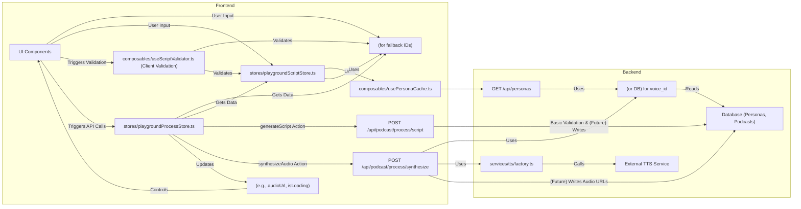

# Playground UI Refactoring: Status and Next Steps

## 1. Introduction and Core Principles

This document outlines the current status of the Playground UI refactoring effort and details the next steps to be taken. The refactoring adheres to the core principles defined in the `playground-final-refactoring-plan.md`:

*   **Unified Data Model**: Strict adherence to interfaces in `types/api/podcast.d.ts`.
*   **Frontend-Led Data Preparation**: `stores/playgroundUnified.ts` (now split into multiple stores) is responsible for transforming user input into the standard format required by backend APIs.
*   **Simplified Backend APIs**: Backend APIs focus on validation, core business logic (like TTS calls), and data persistence, avoiding complex data transformations.
*   **Persona ID as Core**: All role-related operations use `Persona ID`.
*   **Unidirectional Data Flow**: Clear data flow, with the frontend providing final data and the backend performing validation.
*   **Technical Content in English**: All code, comments, logs, and technical documentation are in English.

## 2. Current Refactoring Status (As of YYYY-MM-DD)

The initial phase 집중 on restructuring the Pinia state management has been largely completed.

### 2.1. Pinia Store Restructuring:

The original monolithic `stores/playgroundUnified.ts` has been **emptied** and its functionalities have been successfully **split and migrated** into four new, more focused stores:

*   **`stores/playgroundSettingsStore.ts`**:
    *   **Responsibilities**: Manages basic podcast settings (title, topic, host/guest Persona IDs, TTS provider) and global speech synthesis parameters (`synthesisParams`).
    *   **Status**: Created and implemented. Includes actions for updating settings and selecting/managing personas. Helper methods for ensuring Persona IDs are numeric are included.

*   **`stores/playgroundScriptStore.ts`**:
    *   **Responsibilities**: Manages raw script content (`scriptContent`) and parsed script segments (`parsedSegments`).
    *   **Status**: Created and implemented. Its core `parseScript` action has been enhanced as planned:
        *   Handles asynchronous loading of Persona data from `usePersonaCache`.
        *   Maps speaker names to `speakerPersonaId` using `usePersonaCache`.
        *   Implements fallback logic for `speakerPersonaId` (using host/first guest ID from `playgroundSettingsStore` or `null`).
        *   Adds a `personaMatchStatus: 'exact' | 'fallback' | 'none'` flag to `ScriptSegment` objects for UI feedback.
        *   All internal logging and error messages are in English.

*   **`stores/playgroundProcessStore.ts`**:
    *   **Responsibilities**: Manages state related to backend API calls (loading indicators, errors, API responses, `podcastId`) and contains the actions for these API calls. It acts as a central coordinator, fetching data from other stores to build API requests.
    *   **Status**: Created and implemented.
        *   Includes the core `apiRequest` getter, which assembles the `PodcastCreateRequest` payload for the `/api/podcast/process/script` endpoint.
        *   Contains actions like `generateScript`, `synthesizeAudio`, etc.
        *   API response type interfaces (`SynthesizeApiResponse`, `PreviewSegmentsApiResponse`, `CombineAudioResponse`, `ValidateScriptApiResponse`) are defined within this store.
        *   Temporary `@ts-ignore` comments have been added to suppress persistent TypeScript errors related to the `body` property in `$fetch` calls, with a recommendation for further investigation at the project configuration level.

*   **`stores/playgroundUIStore.ts`**:
    *   **Responsibilities**: Manages UI-specific states (current step, audio URLs, AI script generation progress, etc.) and related helper actions.
    *   **Status**: Created and implemented.
        *   Includes a global `resetAllPlaygroundStates` action that calls reset methods on the other playground stores.
        *   `loadPresetScript` action now updates script content via `playgroundScriptStore` and uses English preset scripts.
### 2.1.1. Confirmed Store Design Principles and Data Flow

Following a detailed review and design discussion, the four new stores will adhere to the following principles to ensure clarity, maintainability, and alignment with backend APIs:

*   **Clear Data Flow**:
    *   User input (podcast settings, script content) is primarily captured and managed by `playgroundSettingsStore` and `playgroundScriptStore` respectively.
    *   `playgroundScriptStore`'s `parseScript` action is responsible for processing raw script content into `ScriptSegment[]` (as defined in `types/api/podcast.d.ts`), including mapping speaker names to `speakerPersonaId` using `usePersonaCache` and fallback logic via `playgroundSettingsStore`.
    *   `playgroundProcessStore` orchestrates API calls. Its `processScript` action constructs the `PodcastCreateRequest` payload using data from `playgroundSettingsStore` and `playgroundScriptStore` (specifically the `parsedSegments`). The response from `/api/podcast/process/script` (containing `podcastId` and `preparedSegments`) is stored within `playgroundProcessStore`.
    *   Subsequent synthesis calls (`synthesizeAllPreparedSegments` action in `playgroundProcessStore`) use the stored `podcastId` and `preparedSegmentsFromApi` to build the `SynthesizeRequestBody` for the `/api/podcast/process/synthesize` endpoint. Global TTS settings from `playgroundSettingsStore` are also included.
    *   The results of synthesis (individual segment audio URLs and statuses) are stored in `playgroundProcessStore` (e.g., in `synthesisResultsPerSegment`).
    *   `playgroundUIStore` primarily manages UI-specific states (e.g., current step, loading indicators derived from `playgroundProcessStore`, active audio previews) and does not directly handle core data mutations or API logic.

*   **`speaker` Field Unification**:
    *   The core data structure for script segments, `ScriptSegment` (defined in `types/api/podcast.d.ts`), uses the field `speaker: string`. This field represents the resolved speaker name after parsing and Persona mapping/fallback.
    *   `playgroundScriptStore.parsedSegments` will store an array of these `ScriptSegment` objects.
    *   All frontend composables (e.g., `useVoiceManagement`, `useSegmentPreview`) and UI components (`VoicePerformanceSettings.vue`, etc.) that consume or manipulate script segments should be updated to use the `speaker: string` field consistently, rather than any alternative like `speakerTag`. If a distinction between the raw tag from the script and the resolved speaker name is needed for specific UI purposes, `playgroundScriptStore` can consider adding an optional, UI-only field like `originalSpeakerTag?: string` to its `parsedSegments`' items, but the primary identifier remains `speaker`.

*   **Modularity and Composables**:
    *   The separation into four stores promotes modularity.
    *   Complex, reusable logic within stores (e.g., advanced script parsing if it evolves, detailed voice assignment heuristics) should be encapsulated in dedicated composable functions, which are then utilized by the store actions. This keeps store files focused on state management and action dispatching.

*   **API Contract Adherence**:
    *   All data structures used for API requests and responses will strictly adhere to the types defined in `types/api/podcast.d.ts` and the established backend API contracts.

### 2.2. Key API Endpoint and Service Decisions:

*   **`/api/podcast/process/validate.post.ts` (and `server/utils/podcastValidationHelpers.ts`)**: Confirmed for **deprecation and removal**. The LLM-assisted script structuring functionality is not aligned with the new frontend-led data preparation model.
*   **`/api/podcast/process/script.post.ts`**: Confirmed as the **core script processing API**. It will receive data in the `PodcastCreateRequest` format.
*   **`/api/podcast/process/synthesize.post.ts`**: Confirmed as the **core speech synthesis API**. It will internally handle the lookup of `voice_model_identifier` based on `speakerPersonaId`.
*   **`server/api/podcast/process/synthesize-segments.post.ts`**: Its functionality will be **integrated into `synthesize.post.ts`** and it will no longer be a separate public API.

### 2.3. Type Definition Updates:

*   **`types/api/podcast.d.ts`**: `ScriptSegment.speakerPersonaId` type updated to `number | null`.
*   **`types/persona.d.ts`**: `Persona` interface updated to include `language_support?: string[] | null;`.

## 3. Next Steps in Refactoring

The following phases and tasks are based on the `playground-final-refactoring-plan.md` and incorporate the decisions made so far.

### 3.1. Phase 1 (Continued): Finalize Frontend Logic Cleanup

*   **Task 1.2: Refactor `composables/useScriptValidator.ts`**
    *   **Objective**: Transform it into a purely client-side form-level validator.
    *   **Actions**:
        *   Remove the API call to the now-deprecated `/api/podcast/process/validate.post.ts`.
        *   Remove the internal `parseScriptToSegments` function (its functionality is now in `playgroundScriptStore.parseScript`).
        *   Retain and refine client-side input validation logic (e.g., checking if podcast title is empty, if a host persona is selected). This composable can be used by UI components before dispatching actions to `playgroundProcessStore`.
        *   Ensure all error messages and logs are in English.

### 3.2. Phase 2: Adjust Backend APIs and Services

*   **Task 2.1: Remove Deprecated Backend Components**
    *   Delete `server/api/podcast/process/validate.post.ts`.
    *   Delete `server/utils/podcastValidationHelpers.ts` (if no longer used by any other retained logic).
*   **Task 2.2: Ensure `/api/podcast/process/script.post.ts` Adherence**
    *   Verify its implementation strictly expects `PodcastCreateRequest` (with `speakerPersonaId` in script segments).
    *   Ensure its validation logic is confined to basic security and format checks.
*   **Task 2.3: Implement `/api/podcast/process/synthesize.post.ts` Logic**
    *   This endpoint must now:
        *   Accept segments containing `speakerPersonaId`.
        *   For each segment, use the `speakerPersonaId` to fetch the corresponding Persona's details (especially `voice_model_identifier` and configured `tts_provider`) using `server/utils/personaFetcher.ts` or direct database access.
        *   Handle any discrepancies between the `ttsProvider` in the request and the Persona's configured provider.
        *   Call the appropriate TTS service via `services/tts/factory.ts` using the fetched `voice_model_identifier`.
        *   Integrate the logic previously in `synthesize-segments.post.ts` for actual TTS calls and file handling (TODOs for object storage upload remain).

### 3.3. Phase 3: UI Component Integration and Testing

*   **Task 3.1: Update UI Components**
    *   Modify all relevant Playground UI components (e.g., `PlaygroundStep1Panel.vue`, `PlaygroundStep2Panel.vue`) to use the new set of Pinia stores (`playgroundSettingsStore`, `playgroundScriptStore`, `playgroundProcessStore`, `playgroundUIStore`).
    *   Remove dependencies on any old/unified stores or composables that have been replaced.
    *   Ensure Persona selection components correctly interact with `usePersonaCache` and update `playgroundSettingsStore` with `Persona ID`s.
    *   Utilize `personaMatchStatus` from `parsedSegments` in `playgroundScriptStore` to provide UI feedback for segments where Persona mapping was a fallback or failed.
*   **Task 3.2: End-to-End Testing**
    *   Conduct thorough manual testing of the entire Playground UI flow.
    *   Update and expand API test cases in `docs/playground-api-testing.md` to reflect the new data flows and API behaviors, focusing on `/api/podcast/process/script.post.ts` and `/api/podcast/process/synthesize.post.ts`.

## 4. Data Flow Diagram (Target Architecture)

## 5. Known Issues / Points for Further Investigation

*   **TypeScript Errors with `$fetch` `body` Property**: Persistent TypeScript errors (`Object literal may only specify known properties, and 'body' does not exist in type 'NitroFetchOptions<any, any>'`) occur in `playgroundProcessStore.ts` for `$fetch` POST calls, even with standard usage and type assertions. These have been temporarily suppressed using `@ts-ignore`. This likely indicates a project-specific Nuxt/Nitro type configuration issue or a conflict with global `$fetch` modifications and requires investigation at the project setup level.

This document should provide a clear path forward for continuing the refactoring work.